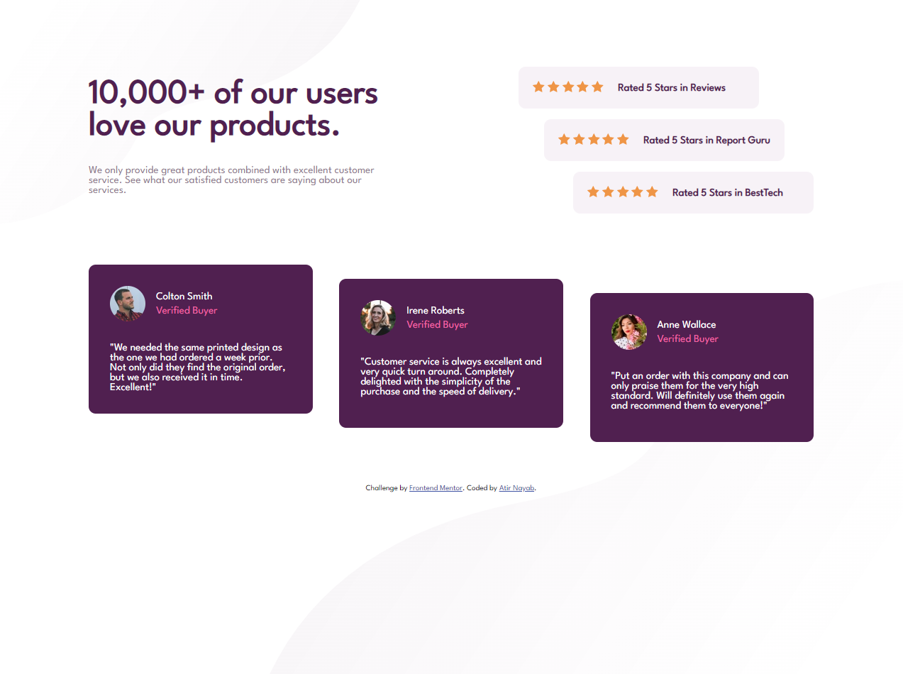

# Frontend Mentor - Social proof section solution

This is a solution to the [Social proof section challenge on Frontend Mentor](https://www.frontendmentor.io/challenges/social-proof-section-6e0qTv_bA). Frontend Mentor challenges help you improve your coding skills by building realistic projects.

## Table of contents

- [Overview](#overview)
  - [The challenge](#the-challenge)
  - [Screenshot](#screenshot)
  - [Links](#links)
- [My process](#my-process)
  - [Built with](#built-with)
  - [What I learned](#what-i-learned)
  - [Continued development](#continued-development)
  - [Useful resources](#useful-resources)
- [Author](#author)
- [Acknowledgments](#acknowledgments)

## Overview

### The challenge

Users should be able to:

- View the optimal layout for the section depending on their device's screen size

### Screenshot

### Links

- Solution URL: [Add solution URL here](https://github.com/nayabatir1/Social-proof-section)
- Live Site URL: [Add live site URL here](https://nayabatir1.github.io/Social-proof-section/)

## My process

### Built with

- Semantic HTML5 markup
- CSS custom properties
- Flexbox
- CSS Grid
- Mobile-first workflow

### What I learned

Revised concept of mobile first desing, grid and flexbox.

### Continued development

I want to continue focusing on designing mobile first design approach.

### Useful resources

- [Using CSS custom properties (variables)](https://developer.mozilla.org/en-US/docs/Web/CSS/Using_CSS_custom_properties) - This helped me to understand css variables.
- [How to Take the Right Approach to Responsive Web Design](https://www.freecodecamp.org/news/taking-the-right-approach-to-responsive-web-design/)

## Author

- Website - [Atir Nayab](https://github.com/nayabatir1)
- Frontend Mentor - [@nayabatir1](https://www.frontendmentor.io/profile/nayabatir1)
- Twitter - [@nayabatir1](https://www.twitter.com/nayabatir1)

## Acknowledgments

I would like to thank [Frantz Kati](https://twitter.com/bahdcoder), he did an exceptional work with growth tracker. He shared many resources how to upskill myself.
